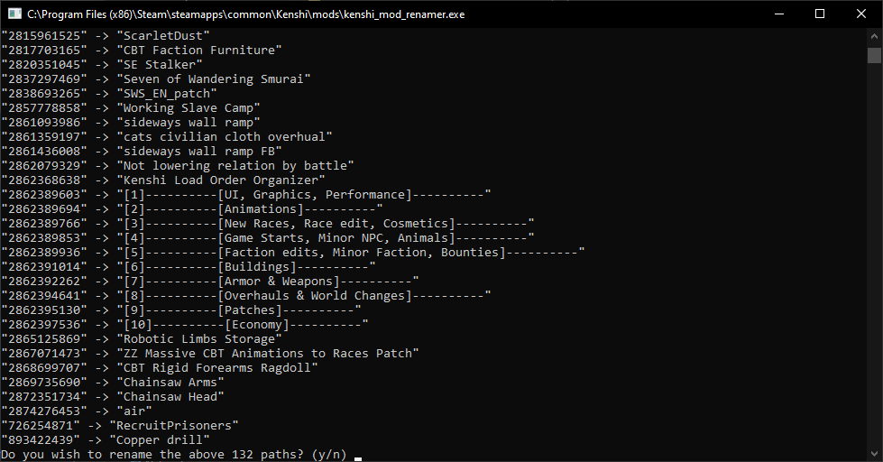

# Kenshi Mod Renamer

A simple tool that renames steam mod directories from the workshop ID to the mod's actual name. 
This allows the mods to be moved into the `Kenshi/mods` directory.

It works by just renaming the outer dirs to be the same as the `.mod` file inside it.

## Usage

Run the executable where the mod dirs you want to rename are located. Then just follow the prompts.

## Compiling

Compiles like a regular Rust binary.

1. Make sure you have [Rust installed](https://www.rust-lang.org/learn/get-started)
2. Run `cargo build --release`
3. Get the executable from `target/release/kenshi_mod_renamer.exe`
